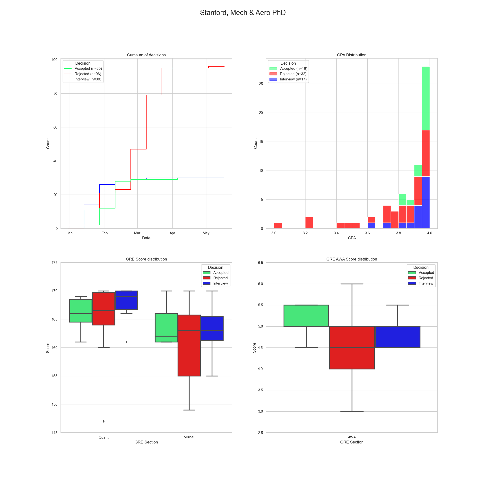

# GradCafe Analysis

This is an attempt at analyzing gradcafe data looking back and trying to make predictions on how the F23 cycle will turn out.

This code was forked from [jjdelvalle's gradcafe analysis app](https://github.com/jjdelvalle/gradcafe_analysis) but due to gradcafe entirely revamping their results page, I rewrote the parser and parts of the notebook and scraper to be more compatible with it.

## Usage

### Scraping

`python3 scrape.py [-q QUERY] [-i INSTITUTION] [-p PROGRAM] [-d DEGREE] [-f FILENAME] pages`

`pages` refers to the number of gradcafe pages searched with 40 results per page. 

`-q` is the catch-all query you type into the big search box on gradcafe. The filters are replicated by the `-i`, `-p` and `-d` flags. 

All of the search options are optional, but the number of pages is not. Also, while the `-f FILENAME` is optional, if you are scraping multiple gradcafe queries, I highly recommend specifying this. Otherwise, your earlier scrapes may be overwritten.

Example for the aerospace dataset I used:

`python3 scrape.py -q '*aero*' -f 'aero' 133`

Example for searching for data about Stanford Mechanical Engineering PhD's:

`python3 scrape.py -i 'Stanford' -p 'Mech' -d 'PhD' -f 'stanford' 6`

You can run the scraper as many times as you want to obtain as specific a dataset as you want.

### Parse the scraped files

This will create a directory with the name of your search query. HTML scraped files will be written in sequential order i.e. `1.html`, `2.html`, etc.

The `parse.py` script is needed to process the HTML scraped files and get a usable CSV file which you can then use to analyze whatever you wish. Its functionality is as follows:

`python3 parse.py filename path pages`

`filename` is the title of the CSV file that comes out, `path` is the path to the directory with the HTML files, and `pages` is how many pages of results you want to process.

A more concrete example would be therefore:

`python3 parse.py aero data/aero 133`

Note that you will have to run the parser for every directory of HTML files you have.

### Analyze the resulting CSV and have fun

Finally, use the `GradAnalysis.ipynb` notebook to generate stats for a specific school and/or program:

```
get_uni_stats(dataframe_of_reports,
	search='search terms',
	title='Title for graph',
	degree='degree',
	field='field')

```

e.g.: 

`get_uni_stats(df_1720, search='Stanford', title='Stanford', degree='PhD', field='Mech & Aero'`)

The above uses a subsetted dataframe with data from only the past 5 years (F18-F23). But you can also search the entire dataset by replacing `df_1720` with just `df`.

The example line of code will generates this image of various stats:



Which is kind of informative because from the GPA and GRE score plots, we can see at a glance that the Mech & Aero PhD programs at Stanford seem to skew towards students who test well. For example, most of the reported acceptances and interviews in the last five years come with a 4.0 GPA. Now compare this with my dataset for Michigan's Aero PhD, which seems to be friendlier towards students with slightly more average GPAs in the 3.5-3.8 range. Of course, this comes with the caveat that the Michigan dataset is significantly smaller and I don't think the sample size is sufficient.


Regardless of sample size, the cumulative frequency plots kind of tell you when you can expect to hear back. In the case of Michigan Aero, there seems to be a large mass rejection in the first half of April, which may or may not have something to do with the fact that decision day is on April 15.

Another thing you can do with the dataset is textual analysis. For example, the `wordcloud` package can generate a word cloud based on frequency of words that appear in the comments of each gradcafe entry, like so:


From the Stanford word cloud on the left, it seems that the most frequent word to appear in gradcafe entries concerned with Stanford's ME PhD program is "interview". Possibly, that indicates that there is a strong correlation between admission results and interviews at this specific program. On the Michigan word cloud on the right, "funding" is the most obvious, and that probably makes sense because the Aero department says on their website very proudly that the program is fully-funded, so advisors probably have to prove that they have enough funds for the student over the entire course of study. What is interesting is also that the word "Masters" appears rather frequently as well, and this could mean a few things: PhD rejectees get offered Masters spots instead, many applicants with a Masters, or something totally different... you probably want another data source to confirm which interpretation is more appropriate.

Also, remember all the data you scraped in step 1? Assuming you ran the parser on all the directories outputted from the scraper, the notebook will combine all the `.csv` files in the `./data` directory into one large unique dataset that you can query as you wish.

There's so much you can do with gradcafe data!

## Shoutouts

The original repository stood on the shoulders of these posts:

* https://debarghyadas.com/writes/the-grad-school-statistics-we-never-had/
* https://github.com/deedy/gradcafe_data
* https://www.reddit.com/r/gradadmissions/comments/7srxxy/decision_timelines_for_particular_universities/

