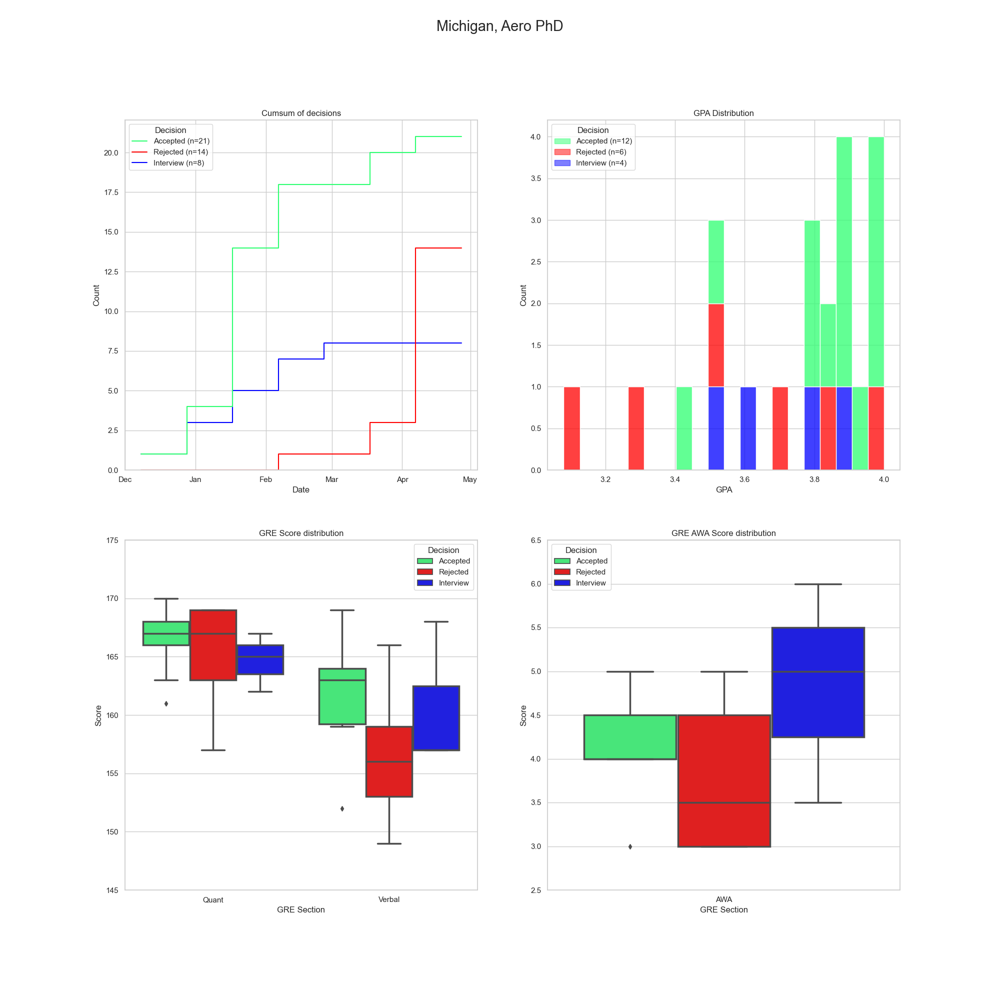

# GradCafe Analysis

This is an attempt at analyzing gradcafe data looking back and trying to make predictions on how the F23 cycle will turn out.

This code was forked from [jjdelvalle's gradcafe analysis app](https://github.com/jjdelvalle/gradcafe_analysis) but due to gradcafe entirely revamping their results page, I rewrote the parser and parts of the notebook and scraper to be more compatible with it.

## Usage

### Scraping

`python3 scrape.py [-q QUERY] [-i INSTITUTION] [-p PROGRAM] [-d DEGREE] [-f FILENAME] pages`

`pages` refers to the number of gradcafe pages searched with 40 results per page. 

`-q` is the catch-all query you type into the big search box on gradcafe. The filters are replicated by the `-i`, `-p` and `-d` flags. 

All of the search options are optional, but the number of pages is not. Also, while the `-f FILENAME` is optional, if you are scraping multiple gradcafe queries, I highly recommend specifying this. Otherwise, your earlier scrapes may be overwritten.

Example for the aerospace dataset I used:

`python3 scrape.py -q '*aero*' -f 'aero' 133`

Example for searching for data about Stanford Mechanical Engineering PhD's:

`python3 scrape.py -i 'Stanford' -p 'Mech' -d 'PhD' -f 'aero' 6`

You can run the scraper as many times as you want to obtain as specific a dataset as you want.

### Parse the scraped files

This will create a directory with the name of your search query. HTML scraped files will be written in sequential order i.e. `1.html`, `2.html`, etc.

The `parse.py` script is needed to process the HTML scraped files and get a usable CSV file which you can then use to analyze whatever you wish. Its functionality is as follows:

`python3 parse.py filename path pages`

`filename` is the title of the CSV file that comes out, `path` is the path to the directory with the HTML files, and `pages` is how many pages of results you want to process.

A more concrete example would be therefore:

`python3 parse.py aero data/aero 133`

Note that you will have to run the parser for every directory of HTML files you have.

### Analyze the resulting CSV and have fun

Finally, use the `GradAnalysis.ipynb` notebook to generate stats for a specific school and/or program:

```
get_uni_stats(dataframe_of_reports,
	search='search terms',
	title='Title for graph',
	degree='degree',
	field='field')

```

e.g.: 

`get_uni_stats(df_1720, search='University of Michigan', title='Michigan', degree='PhD', field='Aero'`)

Which results in this image of various stats:



Remember all the data you scraped in step 1? Assuming you ran the parser on all the directories outputted from the scraper, the notebook will combine all the `.csv` files in the `./data` directory into one large unique dataset that you can query as you wish.

## Shoutouts

The original repository stood on the shoulders of these posts:

* https://debarghyadas.com/writes/the-grad-school-statistics-we-never-had/
* https://github.com/deedy/gradcafe_data
* https://www.reddit.com/r/gradadmissions/comments/7srxxy/decision_timelines_for_particular_universities/

